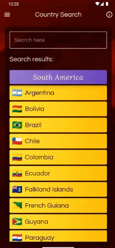

# Countries and flags

## Functional demo, not just code

The app is published on Play Store here : https://play.google.com/store/apps/details?id=com.epikron.countriesandflags

This was initially a challenge I received during an interview that required to make a "Swiping Cards" app, where each card should contain details of an European country.
The country data was provided trough Apollo, an GraphQL API. It was also required to have the layout to adapt seamlessly to different screen sizes and different orientations.
The design was at my discretion (colors, shapes, fonts) as long as a theme was used, and the cards should be draggable, the top card moving at the bottom of the stack.

I decided to add more to that, so I have added the option to change continents, to show more details for each country (that I got in a JSON with data from CIA - The World Factbook), a screen for search, and a small game, all of this to get to use as many "usual" libraries to showcase my abilities.

The tech-stack is : Kotlin, Hilt, Jetpack Compose, Jetpack Coroutines, Jetpack Navigation, Room Database, Coil, Retrofit, Apollo, Mockk, Turbine.

The architecture is MVVM, and as SOLID and CLEAN as to be practical and usable. To advocate my choices here are two links for the sake of argument :
https://developer.android.com/topic/modularization#common-pitfalls
https://softwareengineering.stackexchange.com/a/447543

Could it have been done better? For sure. If I have time to spend on some code I can refactor it and optimize it forever :).
But I have allocated one month of development to this project, and the purpose was to have something functional and nice, and PUBLISHED, with as few problems as possible (crashes and ANR's).

## License

This project is licensed under the Apache License 2.0.
